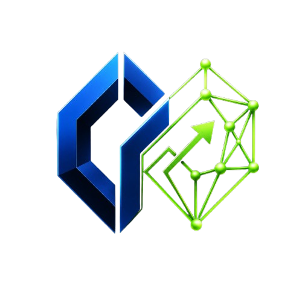

<div align="center">
  
  <h1>TwinDigital</h1>
  <p><strong>DevOps Digital Twin Platform</strong></p>
  <p>
    
    
    
    
    
    
  </p>
</div>

<br />

## 📖 What This Project Does

**TwinDigital** is a comprehensive web-based platform that acts as a "Digital Twin" for cloud infrastructure. It helps DevOps teams visualize, monitor, and safely manage their live Kubernetes clusters without needing to manually run dense terminal commands or read complex YAML files.

When users log into the TwinDigital dashboard, they can:

- **See a True "Live Map" of the Cluster**: 
  The platform continuously syncs with the live Kubernetes cluster. It translates complicated cluster data into an interactive, drag-and-drop ReactFlow map. Users can visually see how their Pods, Nodes, Services, and Ingress controllers are connected in real-time.

- **Simulate Changes in a Safe Sandbox**: 
  Before applying risky infrastructure changes to production, users can simulate them. For example, if an engineer wants to scale a deployment from 3 replicas to 10, they can test it in the isolated sandbox first. The backend evaluates the potential impact (like CPU/RAM constraints) and highlights potential deployment risks *before* it is ever applied to the live cluster.

- **Monitor Live Health & Telemetry**: 
  Users can check live metrics—such as server load, pod health, and resource consumption—directly from the visual map, backed by deep Prometheus and Grafana integration.

- **Automate Provisioning & Deployments**: 
  The entire underlying infrastructure is managed via **Terraform** on AWS. All codebase updates are pushed through a strict 4-stage Jenkins CI/CD pipeline. This means code is automatically tested, securely scanned, containerized via Docker Hub, and deployed straight to the cloud seamlessly.

- **Enforce Role-Based Security**: 
  Different team members have different access levels. **Admins** have full read/write access and can trigger Terraform to spin up new infrastructure or mutate the live Kubernetes resources. **DevOps/Viewers** are restricted to read-only visualization and sandbox simulations to prevent unauthorized live changes.

In short, TwinDigital prevents catastrophic deployment failures by giving engineers total visibility and a safe testing ground for their cloud infrastructure.

---

## ✨ Core Platform Capabilities

### 1. Real-Time Infrastructure Visualization
Translates dense, unreadable Kubernetes YAML and API outputs into a live, interactive drag-and-drop map using **ReactFlow**. Instantly see the relationships between Nodes, Pods, Services, and Ingress controllers.

### 2. Sandboxed Simulations
Safely test potential changes before applying them to production. Simulate what happens when you scale a deployment from 3 replicas to 10, or what infrastructure constraints might be breached during a simulated traffic spike.

### 3. Comprehensive Telemetry & Monitoring
Deep integration with **Prometheus** (for scraping node/pod health and system metrics) and **Grafana** (for visual threshold dashboards).

### 4. DevSecOps Automated Pipeline
A full 4-stage **Jenkins CI/CD pipeline** covering:
- **Build**: Compiling Java/Node code and installing dependencies.
- **Test**: Running unit and integration tests automatically.
- **Scan**: Static Application Security Testing (SAST) and container vulnerability scanning.
- **Deploy**: Pushing verified images to **Docker Hub** and applying the manifests to the Kubernetes cluster.

### 5. Robust Role-Based Access Control (RBAC)
Stateful, highly secure **JWT authentication** routing traffic based on roles:
- **Admin**: Full read/write access (can trigger Terraform and mutate Kubernetes resources).
- **DevOps**: Read-only visualization and simulation sandbox access.

---

## 🛠️ Complete Technology Stack

TwinDigital is built on a modern, enterprise-grade technology stack divided into distinct architectural layers:

### 🎨 Frontend Layer (UI & UX)
- **React 19 + Vite**: Chosen for unmatched rendering speed and modern concurrent UI features.
- **Material UI (MUI 7)**: Provides a professional, highly responsive, and accessible component library.
- **ReactFlow**: The engine powering the interactive digital twin node mapping.
- **Recharts**: Powers the live metrics charts (CPU, RAM usage) directly in the dashboard.

### ⚙️ Backend & API Gateway Layer
- **Node.js 20 LTS (Express)**: Acts as the lightning-fast, asynchronous API Gateway and middleware, aggregating requests from the frontend and routing them to the internal network.
- **Java Spring Boot**: The absolute core of the business logic, structured into **7 independent microservices** handling specific domains such as Auth, Topology parsing, Metrics aggregation, and Simulation logic. 

### ☁️ Infrastructure & Orchestration (AWS + K8s)
- **Amazon Web Services (AWS)**: The entire platform is hosted live on AWS EC2 instances situated in the Mumbai region.
- **Terraform (IaC)**: The entire AWS provisioning process is automated using **4 distinct Terraform Modules** (VPC networking, Subnets, EC2 Instances, and strict Security Groups).
- **Kubernetes (kubeadm)**: Enterprise container orchestration running the microservices, ensuring high availability, load balancing, and self-healing.
- **Docker & Docker Hub**: Every service is containerized. Jenkins builds the Docker images and pushes them directly to **Docker Hub**, replacing older AWS ECR implementations for broader accessibility.

---

## 📂 Detailed Project Structure

```text
TwinDigital/
├── backend/                       # Backend Microservices & API Gateway
│   ├── api-gateway/               # API routing and middleware
│   ├── auth-service/              # JWT Authentication & RBAC
│   ├── cluster-sync-service/      # Kubernetes state synchronization
│   ├── cost-service/              # Infrastructure cost analysis
│   ├── risk-service/              # Deployment risk evaluation
│   ├── simulation-service/        # Sandbox state mutation testing
│   ├── topology-service/          # Cluster mapping logic
│   └── src/                       # Shared internal libraries
├── frontend/                      # React 19 + Vite UI Application
│   ├── public/                    # Static assets (Favicons, Logos)
│   └── src/                       # React components, pages, layouts
├── infrastructure/                # Platform Infrastructure definitions
│   ├── app-deployment/            # Application deployment configurations
│   ├── k8s/                       # Kubernetes YAML Definitions
│   │   ├── configmaps/            # Environment configurations
│   │   ├── deployments/           # Pod replication logic
│   │   ├── ingress/               # Routing rules and load balancing
│   │   ├── rbac/                  # Role-based access control policies
│   │   ├── secrets/               # Encrypted credentials
│   │   └── statefulsets/          # Stateful application deployments
│   ├── remote-state/              # Terraform remote state storage setup
│   └── terraform/                 # Infrastructure as Code Engine
│       └── modules/               # Custom Terraform Modules
│           ├── compute/           # EC2 instances provisioning
│           ├── ecr/               # Elastic Container Registry setup
│           ├── networking/        # VPCs, Subnets, and Gateways
│           └── security/          # Security Groups and firewalls
├── scripts/                       # Utility and automation scripts
├── README.md                      # Comprehensive project documentation
└── Jenkinsfile                    # Declarative Jenkins CI/CD pipeline steps
```

---

## 🚀 Installation & Deployment Guide

### Prerequisites
Before you begin, ensure you have the following installed on your local machine:
- **Git** (Version control)
- **Docker & Docker Compose** (For local containerization)
- **Node.js (v20+)** & **Java (v17+)**
- **Terraform CLI** (For cloud provisioning)
- **AWS CLI** (Configured with your IAM credentials)
- **kubectl** (Kubernetes command-line tool)

### Option A: Local Development via Docker Compose
If you want to run the digital twin locally without provisioning AWS cloud resources:

1. **Clone the Repository**
   ```bash
   git clone https://github.com/RajaniHarika/Digital-twin-Platform.git
   cd Digital-twin-Platform
   ```

2. **Configure Environment Variables**
   Create a `.env` file in the root directory mapping to your local Docker network and JWT secrets.

3. **Build and Spin Up Containers**
   ```bash
   docker-compose up --build -d
   ```
   
4. **Access the Application**
   - Frontend Dashboard: `http://localhost:5173`
   - Node.js API Gateway: `http://localhost:3000`

### Option B: Cloud Production Deployment (Terraform + AWS)
To deploy the platform in a live production environment on AWS (e.g., Mumbai region):

1. **Provision the Infrastructure**
   ```bash
   cd terraform
   terraform init
   terraform plan
   terraform apply --auto-approve
   ```
   *Note: This will utilize the 4 custom modules to build the VPC and launch the EC2 nodes.*

2. **Configure Kubernetes (kubeadm)**
   Once the EC2 instances are live, SSH into the master node and initialize the cluster:
   ```bash
   kubeadm init --pod-network-cidr=10.244.0.0/16
   ```

3. **Trigger the Jenkins Pipeline**
   Configure your Jenkins server to point to this repository. The `Jenkinsfile` will automatically:
   - Build the Java and Node.js codebases.
   - Run security scans.
   - Containerize the apps and push them to **Docker Hub**.
   - Apply the `./k8s/*.yaml` files to the cluster using `kubectl`.

---

## 🛣️ Future Roadmap

While the platform currently solves massive visibility and simulation issues, the following architectural upgrades are planned:

- **GitOps Integration with ArgoCD**: Moving away from a push-based Jenkins deployment to a declarative, pull-based ArgoCD setup that continuously syncs the Kubernetes state directly with the `main` branch.
- **Service Mesh Implementation**: Integrating **Istio** into the Kubernetes cluster to enforce strict mTLS encryption between the 7 Java microservices and to unlock advanced traffic routing capabilities (like Canary deployments).
- **Automated Rollbacks**: Developing a listener that automatically reverts to the previous Docker Hub image tag if Prometheus detects a critical CPU/RAM spike within 5 minutes of a new deployment.
- **Multi-Cloud Scalability**: Expanding the Terraform modules to support Google Kubernetes Engine (GKE) and Azure Kubernetes Service (AKS), allowing the Digital Twin to visualize hybrid-cloud environments seamlessly from one dashboard.
